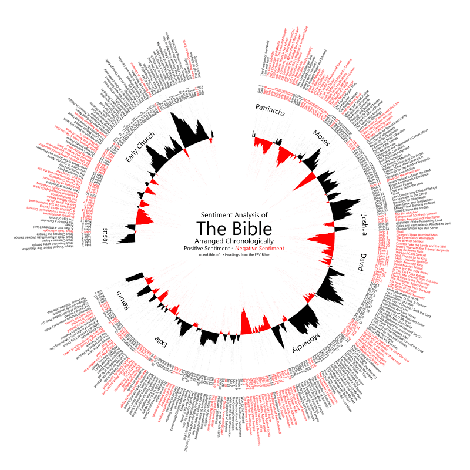

What happens when you look at the language in the Bible, try to determine who's happy and who's not, then graph it all out?

OpenBible.info has done just that and posted a nice, circular graphic showing the ebbs and flows of positive and negative vibes in the Bible. It's a pretty vanilla linguistic analysis, and the circle is just for aesthetics (see the author's comment to the post), but it's still interesting. Accurate? That's another question -- one that I'm not so positive about...
