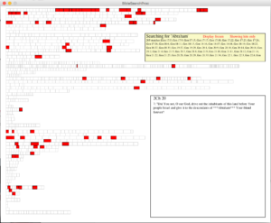

I just posted a new application - [BibleSearchProc](https://bitbucket.org/balinjdl/biblesearchproc) - to Bitbucket.

You can search, display, and navigate the Bible (OT, NT, or full) visually.

- Control-A to toggle display: show all or only hits
- Control-F to toggle display refresh: update on mouseover or freeze
- Type in text to search; updates are 'live' and hits are indicated with a red highlight

 Screenshot of BibleSearchProc in action
