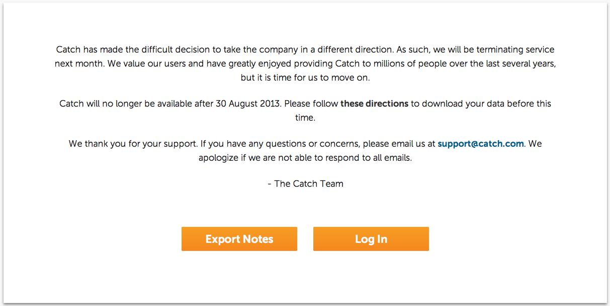

One of my favorite note-taking and general information management apps, , is closing, according to an announcement on its website. I've found Catch to be incredibly simple but both powerful and useful, a rare combination.

_Catch, you will be missed._

 

[TechCrunch has an article available about Catch closing](http://techcrunch.com/2013/07/31/evernote-competitor-catch-com-shuts-down-its-note-taking-apps-company-heading-in-different-direction/), but (as of 7/31 at 6:30pm ET) no more details.

Now, after [exporting my Catch notes](http://support.catch.com/customer/portal/articles/988949-how-can-i-export-notes-on-the-web-interface-), I guess I'll have to move to [Evernote](http://evernote.com)...
