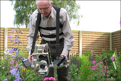
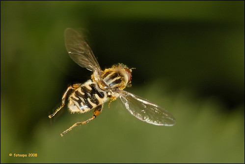

[fotoopa](http://www.flickr.com/photos/fotoopa_hs/) has posted photographs and schematics showing his hardware design for taking pictures of insects _in flight_. While the depth-of-field is very thin (credit card thickness), [the pictures he has posted](http://www.flickr.com/photos/fotoopa_hs/collections/72157616371829502/) are astounding.

> Focus distance can by adjusted to every value. The focus range of the detector is very narrow. 1 to 2 mm at a distance of 700 mm form the camera. Objects of 2 mm diameter can by easily detected. Detector works also on full black insects. 4 lasers are used, 2 IR 5 mw lasers at 850 nm and 2 x 10 mw green lasers. The green lasers are only for visual position to the insects.

The picture above, from Flickr, shows the custom rig in use. While the rig isn't pocket-sized, [the results are astounding](http://www.flickr.com/photos/fotoopa_hs/sets/72157604178299415/). [Lots of details of how he built the rig are provided](http://www.flickr.com/photos/fotoopa_hs/sets/72157604620957208/).

> This unit works on reflected laserlight. No more leaserbeams are needed, no more long arms to put the receivers on the top of the system. The full distance is now free between camera and insects. The unit works in full dark or even in full bright sun. Sensivity can by adjusted by mean of a simple potmeter. To work in full dark 2 to 4 extra high power leds are added. 2 of this high power leds are UV leds at 405nm. This UV light attrack some insects inflight.

\[caption id="" align="alignnone" width="500" caption="Bee in flight (from flickr & fotoopa"\]

")

> ")
