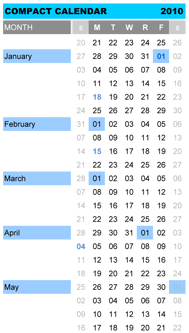

[David Seah](http://davidseah.com/) has updated his Compact Calendar for 2010 and [posted it for download](http://davidseah.com/page/compact-calendar#downloads) (both XLS and PDF versions) on his website: [Compact Calendar 2010](http://davidseah.com/page/compact-calendar). At that link you'll also find numerous international versions and last year's version, too. \[Note: If you feel compelled to spend $50 on a more typographically pleasing calendar, visit [aisleone](http://aisleone.net/2010-Calendar/) and slap your dough down on the table. I'll stick with Mr. Seah's solution. Thanks to him for making it available gratis.\]
