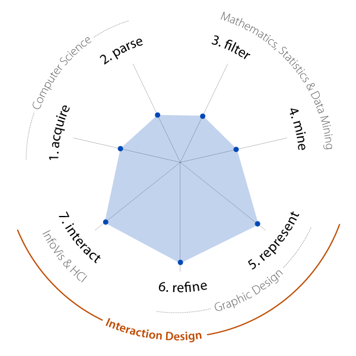

Catherine Mulbrandon took Ben Fry's 7 steps of data the  Data Scientest steps (from [his PhD dissertation](http://benfry.com/phd/) (page 30 etc), dated 1997 and reiterated in [his Visualizing Data book](http://www.oreilly.com/catalog/9780596514556/), as he describes [on his website](http://benfry.com/writing/)) and [graphed her own ability levels in each area](http://www.visualizingeconomics.com/2009/07/12/data-scienist-data-geek-designer/).

Clever use of the original ideas, along with some additional "Testing" inserts of her own. In fact, as a programmer, I would argue for testing between each of these 7 steps. I wouldn't dare use data (from step 1) without validating it, nor move to step 3 without ensuring that step 2 hadn't trashed the data. Indeed, each step assumes a solid foundation from the earlier steps, though, as Mr. Fry mentions, the steps are largely iterative, not linear. True, thankfully.

\[Thanks to DataVisualization.ch for [the link](http://www.datavisualization.ch/articles/data_scientist-data_geek-data_designer).\]
