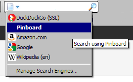

[pinboard.in](http://pinboard.in) is a great service, a cleaner, simpler alternative to [delicious](http://www.delicious.com/). After switching, I've added a lot of new bookmarks, so many that it's getting harder to find ones I need. While I don't spend a lot of time on the pinboard website itself, I found myself wondering what other bookmarks I'd already added.

**Solution**: custom search engine for [the Firefox search bar](http://kb.mozillazine.org/Search_Bar).

It turns out that adding pinboard to the search engine list was pretty straightforward, once I figured out which website guides were out of date...

## Instructions

Turns out that [the Mozilla developer site](https://developer.mozilla.org/) had [the best guide online](https://developer.mozilla.org/en/creating_opensearch_plugins_for_firefox), where it describes field by field how to create the file (or modify an existing file). (_Note_: [some pages](http://maketecheasier.com/how-to-easily-add-a-custom-search-engine-to-your-firefox-search-bar/2008/10/31) instruct the reader to create a file with a "src" extension. That doesn't work for Firefox 5, which I'm using. The file must be an XML file, instead.)

I took the google.xml file and updated it to search pinboard instead. If you're logged in before you search, you'll see only your bookmarks. If you're not logged in, you'll search all the public bookmarks.

## The XML file

<SearchPlugin xmlns="http://www.mozilla.org/2006/browser/search/">
<ShortName>Pinboard</ShortName>
<Description>Pinboard.in Search</Description>
<InputEncoding>UTF-8</InputEncoding>
<Image width="16" height="16" type="image/x-icon">http://www.pinboard.in/favicon.ico</Image>
<Url type="text/html" method="GET" template="http://www.pinboard.in/search">
 <Param name="query" value="{searchTerms}"/>
 <Param name="mine" value="Search Mine"/>
</Url>
<SearchForm>http://www.pinboard.in/</SearchForm>
</SearchPlugin>

## Steps to install

1. Create the XML file with the contents above;
2. Save it as c:\\Program Files\\Mozilla Firefox\\searchplugins\\pinboard.xml
3. Restart Firefox

## Results

Hope you find it useful!
