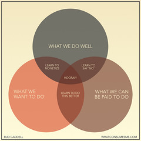

 Bud Caddell (via Flickr: http://www.flickr.com/photos/bud\_caddell/3592960452/sizes/m/)

Thanks to [LifeHacker](http://lifehacker.com/5280491/the-road-to-happiness-in-your-work-lies-in-the-hooray-zone) (via [Kottle](http://www.kottke.org/09/06/how-to-be-happy-in-business)), Bud Caddell has shown [how to be happy in business](http://whatconsumesme.com/2009/what-im-writing/how-to-be-happy-in-business-venn-diagram/) by identifying (hopefully!) the area where what you love overlaps what you know overlaps what you can get paid for. I read about this some years back as practical advice one parent gave her child, but like the simplicty (and labels -- what can I say, I love labels -- they order my life :) of Caddell's venn diagram.
