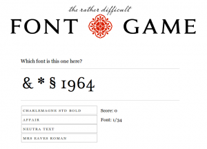

This is pretty nerdy, but I'm getting to really love typography -- serif this, ascender that, kern this, forge that. It all sounds so... foreign. Oooohh. So, when I heard about [I Love Typography](http://ilovetypography.com/fontgame/)'s new little online game, cleverly titled "[The Rather Difficult Font Game](http://ilovetypography.com/fontgame/)" I had to give it a go.

There's even [an iPhone version](http://ilovetypography.com/ifontgame/)!

While spending time playing the game, I like to think I'm honing my typographic skills (such as they are!), but having a blast doing it. When my point counts get higher, I might post them here... Until then, you'll have to keep guessing, just like I do in the game. :)
