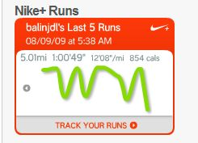

How important is knowing the scale when looking at data? Hopefully, you'll agree, "very", but I was amazed to see how much is missed (and misunderstood) without knowing the scale of my latest run performance.

When reviewing my latest run, I was amazed to see the Nike+ widget graph:

 

Wow! Looks like I was all over the place with my pace. Some strong, some really weak, until I petered out at the end. Looks miserable. That's really strange, since I thought I did pretty well -- kept a pretty steady pace. I.e. _nothing_ like what this chart indicates. So I went over to [my handy-dandy R script](https://blog.balinsbooks.com/2009/06/05/new-r-script-plot-nike-runs/), wanting to see what it said (since I Really believe R :). Lo and behold, it was much more consistent with my expectation:

Much better. So, you can see _some_ variation, but the Nike+ graph suggests that I was almost starting and stopping 3 or 4 times during the run. Without any scale, it's impossible to know just how great those variations were. The R script lets you know exactly.

Would a sparkline be better here, than a line chart?
