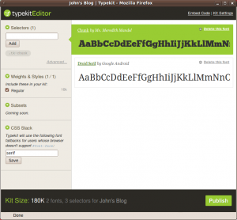

I just updated the site with 2 new fonts from [Typekit](http://typekit.com/): [Chunk](http://typekit.com/fonts/497) for the headers and [Droid Serif](http://typekit.com/fonts/49) for the body copy. [You can also see which faces I'm using](http://typekit.com/colophons/ftj5bsw). Although it's an experiment for now, the potential looks tremendous. After I read that the [Harvard Business Publishing](http://harvardbusiness.org/) is using Typekit on their HBR website, [hbr.org](http://hbr.org/), I thought it would be worth a trial run. What are the benefits? How much does it cost?

## Summary

Initially, I set up a free two-font trial, motivated by the HBR site redesign, of which Typekit is a very visible facet. After reviewing the Typekit site, discovering that they provided a free version, I took the plunge in a measured way. From my initial exposure, I see several key benefits:

- Multiple font support
- A large font library
- Simple setup
- Zero cost

## Multiple Font Support

The Trial level allows for 2 different fonts to be used at a time on your site. That's for free. Hopefully, you'll be inspired to upgrade to a fee-based version to take advantage of more fonts. Upgrading to a pay version (e.g. the $25/year "Personal" (1 website and 5 fonts from the "Personal" library) or $50/year "Portfolio" (5 websites & unlimited fonts from their "Full" library)) gives you more flexibility and can be done, according to their FAQ, at any time through their website.

## Large Font Libraries

My initial setup included two free fonts... Typekit provides 3 levels of libraries: [Trial](http://typekit.com/libraries/trial) (96 different fonts), [Personal](http://typekit.com/libraries/personal) (304 fonts), and [Full](http://typekit.com/libraries/full) (400 fonts). You can browse by [type name](http://typekit.com/fonts), [foundry](http://typekit.com/foundries) (e.g. FontFont, Betatype, Steve Mehallo), or Tag (e.g. fun, handwriting, monospaced), all from [the Typekit home page](http://typekit.com/). Also, you can search for fonts by name or narrow your search based on how you're going to use the font on your page (e.g. "Headline" or "Paragraph").

## Simple Setup

Setup was very easy. After creating a new account, I used the "Kit Editor" (accessible from a button on their homepage) to pick my two fonts -- using their web form, I specified where I wanted to use them. As soon as I made a quick update to my CSS in my WordPress template _voila_, here are the new fonts. A nice slab for the header and roman for the text -- it looks a lot more professional!

## Zero Cost

Best of all, it's free. If I get serious about fonts, I'll flip for the paid version, but for the trial run, free is serving my needs.

## Postscript

After setting this up, I read a little today about [Mozilla's WOFF initiative](http://hacks.mozilla.org/2009/10/woff/) -- an attempt to make fonts more flexible and accessible on the web. It remains to be seen what this means for Typekit, but, given the ease and flexibility of the Typekit solution, WOFF will have to be powerful and simple if it wants to compete.
