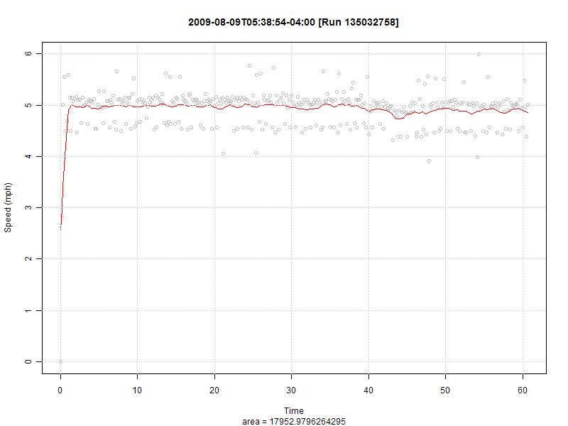

I've been playing around with R and Nike+ and thought I'd put the two together, so I wrote a little R script that pulls your public data from the Nike+ website and plot out the graphs. It's a little rough around the edges (see below for a list of enhancements/fixes), but it generates plots. I like SlowGeek, but found their smoothing function a bit too "smooth" -- it was shaving 1/2 mph from my run speeds. I wasn't happy with that ;) Read more to get the source code, below.

**Sample**: 

For an example of what it might look like, you can [see my plots](http://www.balinsbooks.com/running/).

Here's the script:

\# Version: August 9th, 2009
# Author: John D. Lewis
# License: GPL

library(XML)

basePath <- "c:/temp/"
myUserID <- "9999999999"
runID <- 0
xnew <- c()
xold<-0
yx <- c()
y <- c()
x <- c()

# Get the run data and store the graph in a PNG
saveRunGraph <- function(userID, runID) {
 cat("processing graph ", runID, sep="")

 xnum <- 0
 xnew <- c()
 xold <- 0
 runstart <- character()
 areasum <- 0

 x<-numeric()
 cals <- 0

 newURL <- paste("http://nikeplus.nike.com/nikeplus/v1/services/widget/get\_public\_run.jsp?id=", runID, "&userID=", userID, sep="")
 t<-xmlTreeParse(newURL)
 runstart <- xmlValue(xmlRoot(t)\[\["sportsData"\]\]\[\["startTime"\]\])
 times<-xmlSApply(xmlRoot(t)\[\["sportsData"\]\]\[\["extendedDataList"\]\]\[\["extendedData"\]\], xmlValue)

 cals<-as.numeric(xmlValue(xmlRoot(t)\[\["sportsData"\]\]\[\["runSummary"\]\]\[\["calories"\]\]))
 cat("cals = ", cals, sep="")

 if (cals > 0) {
 y<-sapply(strsplit(times, split=","), function(xstring) {
 xnum<-as.numeric(xstring);
 xnew<-((xnum-xold)\*(3600/5280)\*100\*3.2808399)
 xold<-xnum;
 return(xnew);
 } )

 yx\[\[1\]\]<- 0
 if (length(y) > 1) {
 for (i in 2:length(y)) {
 yx\[\[i\]\]<-(y\[\[i\]\]-y\[\[i-1\]\]);
 }
 }

 x\[1\] = 0;
 for(i in 2:length(yx)) {
 x\[i\]<-x\[i-1\]+1/6;
 }

 # Calculate area under the line
 for (i in 2:length(yx)) {
 areasum <- areasum + (5\*(yx\[i\]+yx\[i-1\]))
 }
 cat("areasum = ", areasum, sep="")  

 pngfilename <- paste("nike\_run\_", userID, "\_", runID, ".png", sep="")
 pngfilenamewithpath <- paste(basePath, pngfilename, sep="")
 png( filename=pngfilenamewithpath, bg="white", width = 800, height = 600 )
 plot(x, yx, main=paste(runstart, " \[Run ", runID, "\]", sep=""), sub=paste("area = ", (areasum), sep=""), xlab="Time", ylab="Speed (mph)", col="gray")
 # Changing the f value to 1/20 results in smoother graphs, but misses the outerbounds
 # Changing the f value to 1/50 results in jagged graphs, but sticks to the source points more
 lines(lowess(x,yx, f=1/25, iter=.45), col="red")
 grid()
 cat("Done saving", pngfilename, "\\n")
 dev.off()
 return(pngfilename)
 } else {
 cat("No calories burned, so skipping file.")
 return("na")
 }
}

# 1. Get list of all runs from Nike+ website
runlistxml<-xmlTreeParse(paste("http://nikeplus.nike.com/nikeplus/v1/services/widget/get\_public\_run\_list.jsp?userID=", myUserID, sep=""))
runs<-(xmlRoot(runlistxml)\[\["runList"\]\])
cat("Generating graphs for ", length(runs), " runs\\n\\n", sep="")

outputHTMLFilename <- paste(basePath, "runlist.html", sep="")
htmlfile <- file(outputHTMLFilename, "w")
cat("<UL>", file=htmlfile)

# 2. Process each run individually
for (i in length(runs):1) {
 xnew <- numeric()
 xnum <- numeric()
 xold <- numeric()
 y <- numeric(6000)
 yx <- numeric()
 t <- c()
 times <- c()

 run <- runs\[\[i\]\]
 runID <- xmlAttrs(run)\["id"\]
 #cat("Fetching graph for run ", runID, "\\n")
 filename <- saveRunGraph(myUserID, runID)
 cat("<LI></LI>\\n", sep="", file=htmlfile)
}

cat("</UL>\\n", file=htmlfile)
close(htmlfile)
shell.exec(outputHTMLFilename)

**Update (6/6/09)**:

- Added date/time to head of each chart
- Reversed order of list, so most recent run is at the top
- Posted updated script

**Update (8/9/09)**:

- Removed extra commented-out debugging lines
- Added shell.exec to open HTML automatically after completion

**Enhancements**:

- Print the real time, rather than a long number (anyone know how to process Nike+'s timestamp in R?)
- Better handling of the userID and basePath settings (config file?)
- More flexibility in managing smoothing parameters (like [runnerplus.com](http://www.runnerplus.com/run/8168-753400/)'s "Less"/"More Detail" slider bar, which is very slick)
