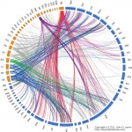

I've struggled with a way to visually depict how often (and how) the New Testament writers used the Old Testament, whether explicitly (quotations) or implicitly (allusions). While trying to come up with something useful and visually appealing, I found two separate, yet very useful tools:

- [New Testament References to Old Testament Scriptures](http://mb-soft.com/believe/txh/ntot.htm) (http://mb-soft.com/believe/txh/ntot.htm) -- a list of OT quotations. Thanks to Carl, at mb-soft, for permission to use their data in generating this graphic;
- [Circos](http://circos.ca/) (http://circos.ca) -- a collection of perl scripts to generate radial convergence diagrams; originally designed for visualizing genomic data.

I've compiled a set of config files based on the mb-soft page above for use by Circos to generate a graphic showing all the quotations/allusions/possible-allusions in the New Testament. Here's my second version of the graphic (click on the link for a larger version).

### Legend:

**Rings:**

- Blue ring = Old Testament books (starting with Genesis in the top (12 o'clock) position clockwise through Malachi (around the 8 o'clock position);
- Orange ring = New Testament books (starting with Matthew right after Malachi, through Revelation ending right before Genesis);

**Lines**:

- Blue = Links in the Synoptic gospels
- Green = Links in the gospel of John
- Purple = Links in Hebrews
- Red = Links in Revelation
- Grey = Links in the rest of the New Testament books

If you're interested in the config files, let me know by posting a comment.
