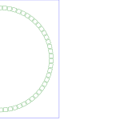
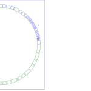
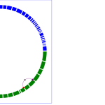

I'm building a JavaScript-based graphic depicting references of Old Testament passages in the New Testament. I originally started with Circos (see [earlier post](https://blog.balinsbooks.com/2011/06/27/old-testamentnew-testament-reference-graphic/ "Old Testament/New Testament reference graphic"): [Old Testament/New Testament reference graphic](https://blog.balinsbooks.com/2011/06/27/old-testamentnew-testament-reference-graphic/ "Permanent Link to Old Testament/New Testament reference graphic")), but didn't like the lack of interactivity. Circos makes very pretty static graphics, but I'd like to be able to drill down and adjust the display based on user-input.

I recently discovered Paper.js ([http://www.paperjs.org/](http://www.paperjs.org/)), which looks very flexible and comprehensive. So, thinking I can build it with Paper.js, I began playing with the library, figuring out how to build something that at least looks like Circos, but without all the extra bells-and-whistles it has that I just don't need. So far, I have completed three basic graphs...

### Work Completed

So far, I've completed three preliminary and very basic code milestones:

1. A circular graphic where all 66 books are present, but are all evenly sized and distributed. Book "arcs" are hollow and monochromatic. No data about the books are read -- just generated 66 arcs evenly spaced and sized around the circle;
2. A circular graphic extending the first rev by showing relative sizes of each book (more chapters = wider arc). Old Testament books are green and New Testament are blue. Arcs are still hollow. Implemented book data via a new array (cleverly called "books") that contains basic info about each book (name, abbrev, number of chapters, starting point and ending point (updated as the arcs are drawn). The data from the array was generated by manipulating the existing Circos config file I was using previously;
3. Filled-in arcs (still green or blue). Implemented the first connector between two books -- static links for now.

### To Do

Read in the links from the Circos config file (or generate another array based on the config file);

- Add book labels;
- Add interactivity;
- Add columns for each chapter (useful?);
- Add other features?

Have you built (or thought of building) anything like this, using either JavaScript or another language? If so, let me know what you found.
