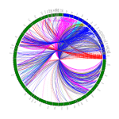

## Completed

- Added book names/labels (reversed orientation and set justification="right" when angle < 90 or > 270)
- Added chapter ticks (first chapter + every 10th chapter)
- Added think black border around book arc
- Reduced thickness of link lines (from 2pt to 1pt)
- Added buffer between link line ends and book arcs ("var innerBuffer = 5")
- Added allusion links and possible allusion links (both are dashed; wider dashes = possible allusion) \[display of allusions and possible allusions are managed via a boolean variable for each setting\]

## To Do -- cumulative

_In priority order:_

- Add book labels
- Fix intermediate point calculation
- Add interactivity \[to do what?\]
- Add columns for each chapter (why?)
- Add the allusion links and possible \[allusion\] links
- Set up correct Z-order (handled by order of function calls)
