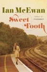

[Sweet Tooth](http://www.goodreads.com/book/show/13572814-sweet-tooth) by [Ian McEwan](http://www.goodreads.com/author/show/2408.Ian_McEwan)  
My rating: [2 of 5 stars](http://www.goodreads.com/review/show/463299879)  
  
I have thoroughly enjoyed some of McEwan's previous works, including [On Chesil Beach](http://www.goodreads.com/book/show/815309.On_Chesil_Beach "On Chesil Beach by Ian McEwan"), [Saturday](http://www.goodreads.com/book/show/5015.Saturday "Saturday by Ian McEwan"), and, to a lesser extent, [Solar](http://www.goodreads.com/book/show/7140754.Solar "Solar by Ian McEwan"). I found his writing in those works to be beautiful and elegant. [Sweet Tooth](http://www.goodreads.com/book/show/13562049.Sweet_Tooth "Sweet Tooth by Ian McEwan") is my least liked of McEwan's books. I found the twist at the end insufficient to justify the length of the work, the writing to be less enthralling than his other works, and the plot at times droll. Character development is inconsistent. Unfortunately, I would not recommend this book to others; I would stick to some of his earlier works.  
  
[View all my reviews](http://www.goodreads.com/review/list/4094446-john)
