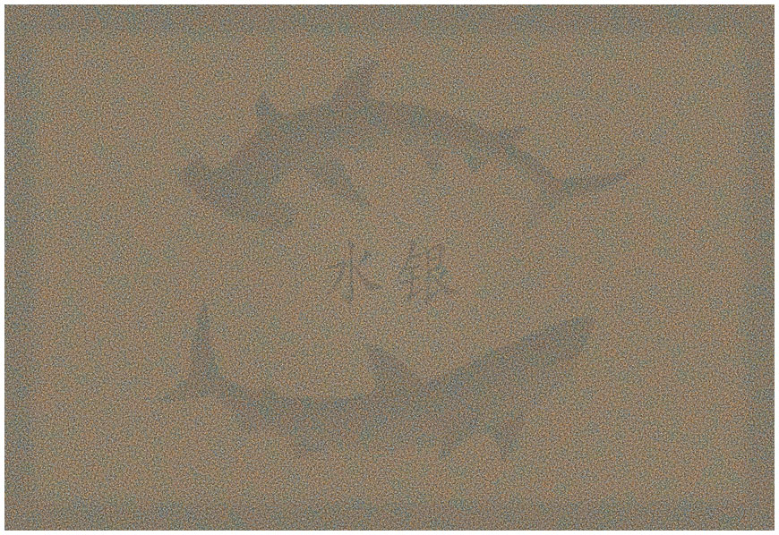

  
Shark Teeth, 2009 by Chris Jordan.  

[Chris Jordan](http://www.chrisjordan.com/) reveals a new perspective of scale in his [Running the Numbers II](http://www.chrisjordan.com/current_set2.php?id=9) art online. Subtitled _Portraits of global mass culture_, the pieces depict the scale of our world around us -- and how we mistreat it. Take a look, making sure to look at the zoom/detailed samples.
