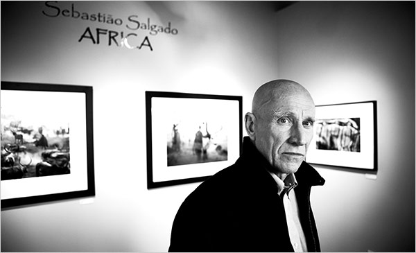

Photo of S. Salgado by Kevin Scanlon for The New York Times

Sebastião Salgado spends weeks with remote tribes before taking a picture. He hikes 500 miles to be where he needs to be for the shot he has in his mind. All marks of a clearly dedicated and driven photographer. With this intensity and determination, when he says “I came here for special things, but my head is there, my body is there"..."I might be sleeping in a hotel room in Los Angeles, but in my mind I am always editing pictures" you can believe it.

[Art - Sebastião Salgado - Back to Nature, in Pictures and Action - NYTimes.com](http://www.nytimes.com/2009/05/31/arts/design/31fink.html).
