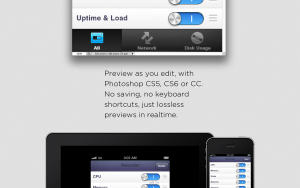

Bjango ([http://bjango.com](http://bjango.com)) makes a nice, simple, but very effective color picker for Mac OS X - [Skala Color](http://bjango.com/mac/skalacolor/).

Why use a custom color picker? As their website points out - Skala Color provides color values in Hex, CSS RGBA, CSS HSLA, UIColor, NSColor, among others. So, if you're building a web app, an Android app, or an iOS/OS X app, you're covered. It is very easy to install and use. Both simple and powerful is an unusual pair of qualities, but Skala Color carries them both off very well. Best of all, the price is right -- free!

Bjango also makes several other apps including [iStat Mini](http://bjango.com/mac/istatmini/), a system monitor that fits in the notification window, and [Skala Preview](http://bjango.com/mac/skalapreview/) that shows "pixel perfect" views for multiple devices. Their "precise user interface and icon design tool", [Skala](http://bjango.com/mac/skala/), is "coming soonish" - but should be worth a serious look, if their other apps are any indication.

 Skala Preview - from Bjango media kit
