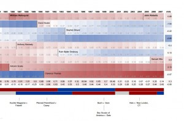

[Andrew Martin](http://adm.wustl.edu/) (Washington University, School of Law) and [Kevin Quinn](http://www.law.berkeley.edu/kevinmquinn.htm) (U.C. Berkeley School of Law) devised the [Martin-Quinn scoring system](http://mqscores.wustl.edu/) to gauge the ideological flavor of courts. [Alex Lundry](http://www.twitter.com/alexlundry) applied that scoring system to the SCOTUS to create a fascinating visualization showing the conservative/liberal tendencies of each justice since 1937, along with an overall score of the entire court: [The Ideological History of the Supreme Court of the U.S. (SCOTUS) - TargetPoint](http://www.targetpointconsulting.com/scotusscores-labels.html). He (along with [Carl Roose](http://www.carlroose.com/) who adapted the graphic for the web) clearly spent a lot of time going through the court's history, applying the scoring system to show both by justice and collectively, by year, the court leaned.

The snapshot shown here is only the latest portion of the chart -- take a look at [the whole page](http://www.targetpointconsulting.com/scotusscores-labels.html) for additional details, along with a couple videos, including [an intro](http://vimeo.com/4515162).
