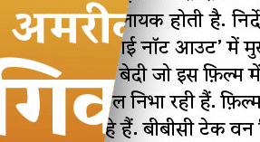

")

How are fonts designed? What are the steps and decisions a font designer must make to create a really vibrant and successful font? As someone who recently started enjoying fonts, I've never really considered these questions, until now. On the [i love typography](http://ilovetypography.com/) website (one of my favorite blogs and websites), [Rob Keller](http://www.motaitalic.com/info/about-us), of [Mota Italic](http://www.motaitalic.com/), describes [The Making of Vesper](http://ilovetypography.com/2009/12/15/font-design-vesper-typeface-devanagari/), broken down into two phases of his design process as he created a new font, [Vesper](http://www.motaitalic.com/fonts/vesper/purchase-vesper/): The first phase, comprising the Regular, Devanagari, Heavy, and Italic, was completed during his stint at the [Masters in Arts, Typographic Design](http://www.reading.ac.uk/typography/pg-taught/typ-pgtmatypefacedesign.aspx), at [the University of Reading](http://www.reading.ac.uk/). After completing the MA, Rob completed the font's remaining weights and revised the existing weights.

He provided some interesting details about the process and how he made some design decisions throughout, all of which have a real bearing on the final result.

## At Reading

### Devanagari

Rob makes it clear from the beginning that [Devanagari](http://www.motaitalic.com/fonts/vesper-devanagari/overview) was a very important part of Vesper's design, giving credit largely to [Fiona Ross](http://new.myfonts.com/person/Fiona_Ross/), a lecturer at the MATD program. The soft breaks and curves were coordinated between both the Devanagari and Latin characters. (You'll appreciate his careful use of animated GIFs throughout his post to provide comparisons and simple illustrations.)

### Heavy and Italic, including Dots

As the third effort on Vesper at the MATD, Rob completed the Heavy and Italic weights. He highlights the effort he put into the dots (e.g. comma, the dot over the lowercase "i") — ensuring they were angled properly with relation to the rest of the font. Attentions to fine details like these show in the resulting font through an overall cohesion and compatibility between the font elements.

## After Reading

### Time Off

Rob makes a very important point — you need time away to gain more objectivity. After he completed his MA, he took some time off from Vesper. On returning to it, he had a clearer approach and was able to see some adjustments to improve the font:

> Once I got back to work, it was actually quicker and more precise to simply redraw these two styles from scratch, rather than to adjust the old files.

He redrew the Heavy and Italic and then created the Heavy Italic weight.

### Contextual Alternates

[")](http://cdn.ilovetypography.com/img/2009/12/contextual-alts-1.jpg)

Kerning and spacing are huge design decisions and issues for font designers. What is the right spacing? With serifs especially, characters have clumsy interactions that detract from the overall aesthetics of the font. To address that issue, Rob identified "Contextual Alternates":

> There are over a hundred additional characters (including accented versions) that get automatically substituted in certain letter sequences. They are only subtly modified from the default shapes, but they can still make dramatic changes to the text.

Notice the v and y, the w pair together. The serifs are slightly tweaked to avoid ungainly clashes, to distinguish the characters, and to keep a neat-and-tidy appearance altogether. Very nice touch and reveals yet another reason why Vesper is such a great font face.

### Vesper for the Web

Rob concludes his post with a brief discussion of TrueType tweaks to make Vesper appealing to website designers, "to make it more useful for on-screen reading." By using TT hinting and combining the OpenType package with .woff, .eot, and .svg formats, the font can be embedded in a website easily. Slick.

## Postscript: The Name

Where did Rob get the name of the font? Well...

> \[The Devanagari sample text\] was actually taken from a newspaper headline I have here… I picked up an issue of the Dainik Bhaskar in London a bit after Casino Royal \[sic\] came out (which was around the time I was trying to name the typeface). But trying to sound out the Hindi in the headline made me stumble across the fact it was transliterated English.

The next time you're looking to name a font, you might consider the latest Bond film for inspiration.

Finally, you can [purchase Vesper at the Mota Italic website](http://www.motaitalic.com/fonts/vesper/purchase-vesper/).
