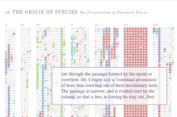

I've always enjoyed a nice graphical diff, like [WinDiff](http://en.wikipedia.org/wiki/WinDiff), [WinMerge](http://winmerge.org/), or [KDiff3](http://kdiff3.sourceforge.net/) -- something that shows how a document has changed since some previous incarnation. [Ben Fry](http://www.benfry.com/), father of [Processing](http://processing.org/), has taken this idea to an extreme with Darwin's [_Origin of Species_](http://darwin-online.org.uk/) by showing how Darwin's book changed with each revision, graphically depicting the variations in the document by chapter with each revision.

A static picture can't do the app justice -- enjoy the treat of watching the book unfold over time. Notice how each chapter changes, both at the macro level (where you see the edits take place looking like DNA markers, each block color coded with the color of the edition wherein it was modified) and at the micro level (mouse over one of the blocks to see the text, also highlighted by edition revised). Quite a treat and a nice display of what Processing, in the hands of a master, can do. (Fry also has a write-up of the app on his blog.)

I wonder what it would take to package this up so someone could use this approach on any large body of text? For example, it could be used, with slight changes, to show how the manuscripts of the New Testament changed -- starting with the oldest and moving through the [Codex Siniaticus](http://www.codexsinaiticus.org/en/) and through later manuscripts. Hmmm...
