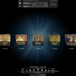
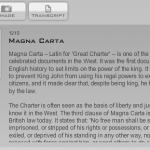
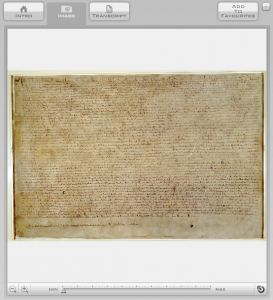
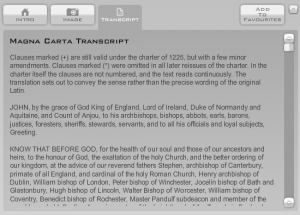

The [British Library](http://www.bl.uk/) has released a new website, [Timelines: sources from history](http://www.bl.uk/timeline), where users can traverse history "from Magna Carta to Obama." From to the website:

> The interactive timeline allows you to explore British Library collection items chronologically, from medieval times to the present day. It includes a diverse combination of texts: those that allow glimpses of everyday life (handbills, posters, letters, diaries), remnants of political events (charters, speeches, campaign leaflets), and the writings of some of our best known historical and literary figures.

The Flash-driven site has a rudimentary timeline navigation bar plus thumbnail images for each entry. When you click on one of the thumbnails, you are given additional choices. For the Magna Carta, e.g., you see three options: a short Introduction to the work; a zoomable image of the work; and a transcript of the text itself. Other works have various differing options, based on the type and language of the original.

I'm not sure why they couldn't go back before the Magna Carta. Of all the resources in the world, the BL has [many wonderful manuscripts](http://www.bl.uk/catalogues/illuminatedmanuscripts/welcome.htm), such as [the Lindisfarne Gospels](http://www.bl.uk/onlinegallery/hightours/lindgosp/large17328.html) (Cotton Nero D.IV). Nevertheless, take a few minutes to enjoy the works they do have online.
