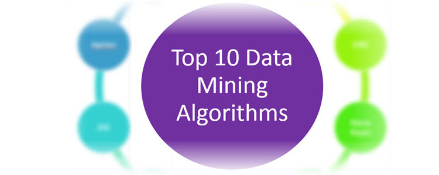

Helpful intro post to data mining algorithms by Raymond Li at Rayli.net:

> Today, I’m going to explain in plain English the top 10 most influential data mining algorithms as voted on by 3 separate panels in this 2007 survey paper.

Source: _[Top 10 data mining algorithms in plain English](http://rayli.net/blog/data/top-10-data-mining-algorithms-in-plain-english/)_
