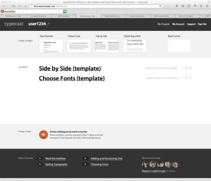

[Typecast](http://beta.typecastapp.com/) (beta.typecastapp.com) is a new website from Front designed to make web typography and design easier.

Supporting fonts from [typekit](http://typekit.com), [fonts.com](http://fonts.com), [Font Desk](http://fontdesk.com), and [Google web fonts](http://www.google.com/webfonts), Typecast provides a simple and flexible formatting solution for blocks of text on a web page. Currently in beta, as of 22 October, the site is open for everyone and free to use. (They will start charging for font use when the site leaves beta.)

Creating blocks of text is as simple as a few clicks; setting a consistent font size, line height, and color is a few more clicks. Soon, you'll have a page with an even look-and-feel, letting you spend more of your time focusing on the content.

 

Four intro videos walk you through the basics of using the site. Pricing and release date have not been announced. Looks very promising.

**Update (10/30)**: Monotype acquires Typecast. See [the announcement](http://typecast.com/monotype-acquires-design-by-front) or [the blog post](http://typecast.com/blog/typecast-joins-monotype) announcing the purchase.
