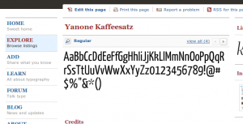

 

[Typedia: A Shared Encyclopedia of Typefaces](http://typedia.com/) is "a resource to classify, categorize, and connect typefaces" providing a wealth of information, links, visuals, and sources for many typefaces. Navigate the fonts by type (humanist, poster, sans, etc) or search by name or creator. Each font page links to:

- Designer(s)
- Foundry(ies)
- Release Year
- Country of Origin
- Classification
- Original Format
- Distributor(s)
- Tags

It also provides a background/history for each font, as well as linking to examples "in the wild." Very well designed, orderly, clean, and useful.
