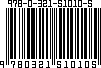

In keeping track of my books, I have been looking for a simple way to generate barcodes as individual graphics that I could embed in my book list. I think I've found it: Dan Bornstein's [Barcode Server](http://www.milk.com/barcode/), which I found at the [BarcodesInc](http://www.barcodesinc.com/)'s [UPC/EAN Barcode Generator](http://www.barcodesinc.com/generator/barcode/).While the online version is nice, I wanted something a little more flexible and robust, so I downloaded the C source code.

I haven't tested it using a label scanner, but it _looks_ real enough! A visual check with the label on the book didn't uncover any glaring differences, but then again, I'm a human reading what was meant to be read only by machines, so YMMV. If you're interested in generating barcodes, it's worth a few minutes of you time investigating Mr. Bornstein's code. It compiled out-of-the-box on my Linux system. I created my first XBM barcode within 10 minutes of downloading the source code, using the built-in gcc. It took longer to read the header and figure out the command-line parameters than it took to actually build and run it. Once I decoded the instructions, it ran like a charm. When I finally splurge to get a simple label scanner, this will be key! Creating a perl script to read the ISBN from a text file or database, create the [XBM](http://en.wikipedia.org/wiki/X_BitMap), then convert the XBM to a [PNG](http://en.wikipedia.org/wiki/Portable_Network_Graphics) (using, e.g., [ImageMagick](http://www.imagemagick.org/script/index.php) or [GIMP](http://www.gimp.org/) (which I used for the image above)) shouldn't be a big deal at all.

If you're more interested in generating the code through a web interface, you're in luck! You can stuff your numbers into the Barcode Generator and save the resulting graphic to your hard drive one at a time. I'll stick to the local binary, but the fact that BarcodesInc is making the web front-end available for free is quite nice! Thanks to them (and to [Mr. Bornstein](http://www.milk.com/home/danfuzz/), too, of course ;)!
