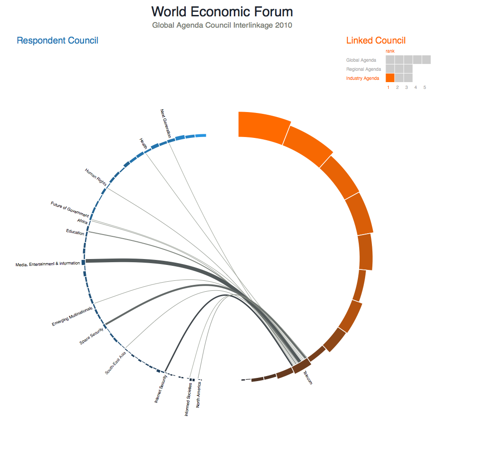

Found this visualization from Jan Willem Tulp: [World Economic Forum - Visualization Challenge](http://www.janwillemtulp.com/worldeconomicforum/). Looks very much like the visualization I did for [Old Testament and New Testament references](https://blog.balinsbooks.com/2011/07/09/otnt-refs-source-code-now-available-on-github/ "OT/NT Refs: Source code now available on GitHub"), but overall much more professional and polished. Since it was written using [protovis](http://mbostock.github.com/protovis/), I might see if I can port [OTNT](https://blog.balinsbooks.com/2011/07/06/otnt-graphic-development-slideshow/ "OTNT Graphic Development slideshow") to mimic his view. Also uses [grid960.css](http://960.gs/), which I've wanted to use. Sounds like a fun challenge...
